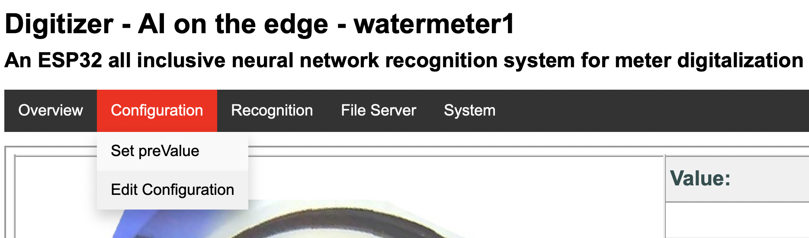
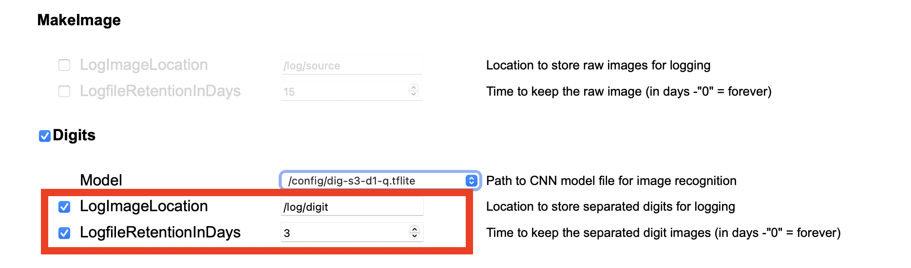
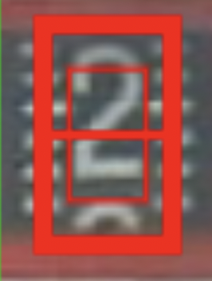
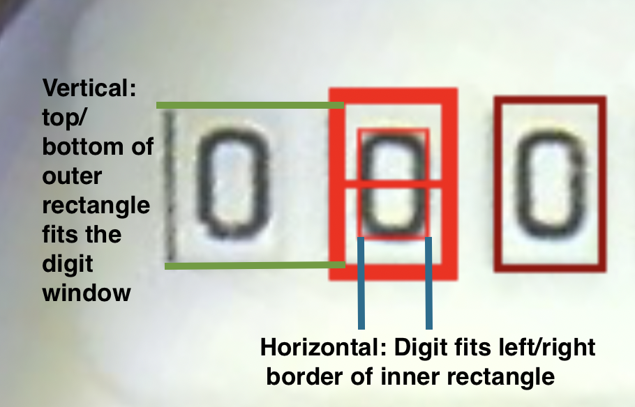
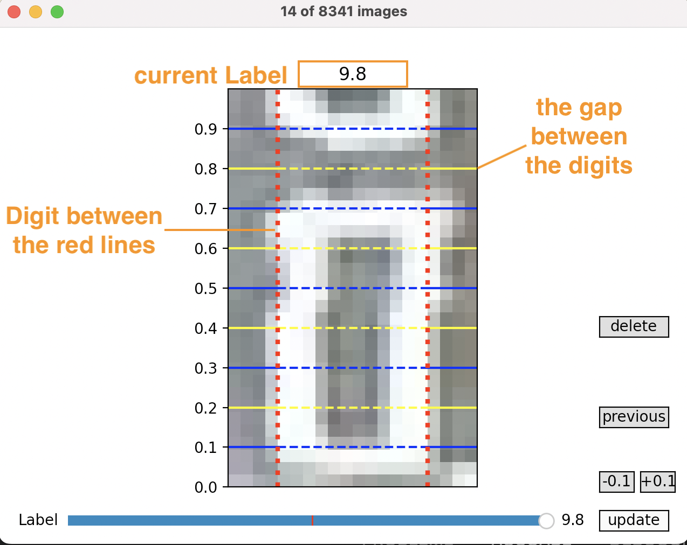
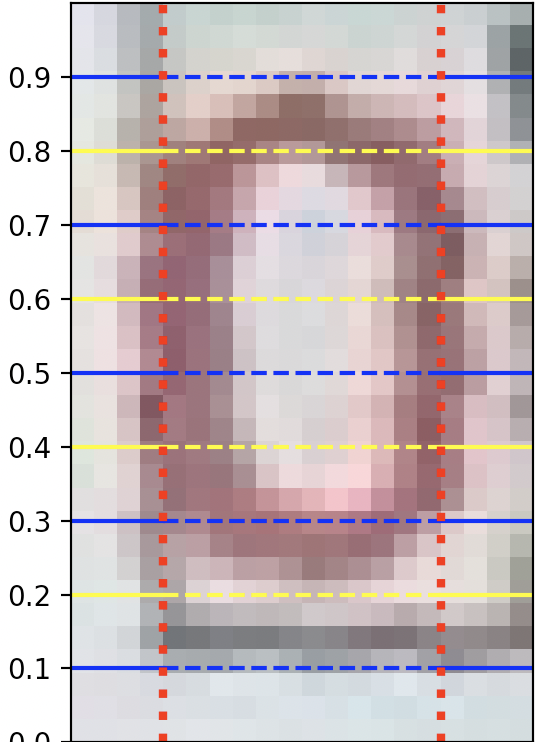
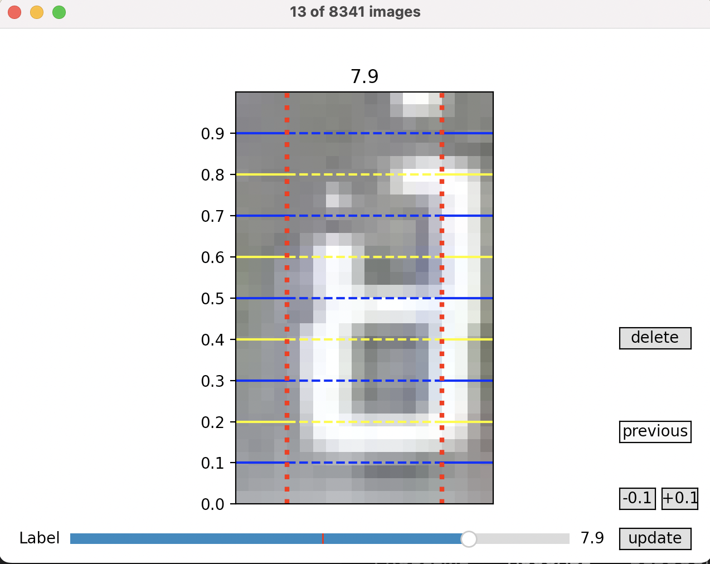
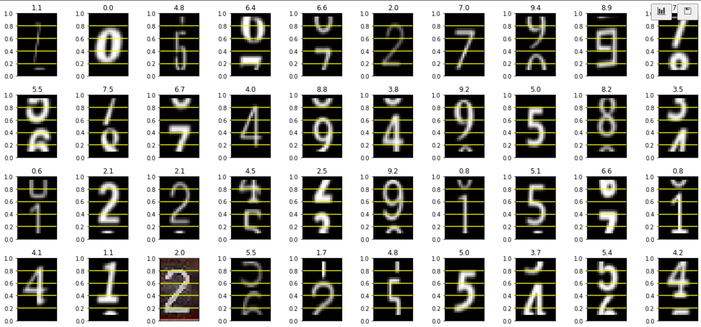

# Readout edge AI digits from meters

Help us to get more image data and improve your own digit meter predictions!

## Setup your watermeter device

Before you can read the images, you have to configure the logging of the digits in your device.

Go to you devices and open the configuration.

Now setup the *LogfileRetentionsInDays*. You have to select the checkbox if not already configured.

Please do not change the path of *LogImageLocation* ( /log/digit )

If you had to enable the image logging, you need wait a few days before you can readout all the images.

### Configure ROIs (regions of interest) correctly

Before you read out the images, have a look at

<https://github.com/jomjol/AI-on-the-edge-device/wiki/ROI-Configuration> . It is essential to get good images to learn the neuronal network.

**But the height should be based on the window edges and on the digit.**

For best result you should uncheck the *Lock aspect ratio* option. When setup the digit it should fit the inner rectangle. Now move up/down to fit the digit window.

After all the digit need not to be in the inner window, but should have the right size to fit in. And you should not have a lower/upper border for best results.

The middle line indicates the center of the image, if it is in the x.0 position. In this case it should fit exactly in the inner rectangle.

### Read the images

### Read the images

#### Install collectmeterdigits

The [releases](https://github.com/haverland/collectmeterdigits/releases) contains downloads for Windows, Linux and MacOS. But the prefered install is via python's pip.

##### Python

This is mostly the easiest part, if you have installed python on your computer. If not you need to install it ( <https://www.python.org/downloads/> ).

Open a terminal and type in:

    pip install git+https://github.com/haverland/collectmeterdigits

On mac and windows the prediction is not available. It shows everytime a -1. You can manually install it by 

    pip install tensorflow-macos 
or

    pip install tensorflow

The application is called via console

    python3 -m collectmeterdigits --collect=<your-esp32name> --days=3

It downloads now all images in a "data" subfolder. The image names will be hashed for your privacy.
Be patiant. It will takes a while.

After it the duplicates will be automaticly removed and finally you have a folder named data/labled with the images.

##### Windows, MacOS, Linux

The executables are console applications. You can use it like python

    Windows-collectmeterdigits.exe --collect=<your-esp32name> --days=3
,

    Linux-collectmeterdigits --collect=<your-esp32name> --days=3
or

    collectmeterdigits --collect=<your-esp32name> --days=3

Windows and MacOS excecutables have no prediction, because the tflite-runtime is only available for linux and the complete tensorflow library is to big (600MB) for a single application.

### Label the images

Now you can label the images. After reading the images it opens a window.

You can see the digit and have to readjust the label. If it is correctly, you can click on
update. If not use the slider to adjust it.

The yellow and blue lines helps you. Look at the gap between the digits. At left scale you read the value. Don't worry, it must not 100% right. And sometimes it's not easy to choose the value.

The prediction on the left side can help you to identify the digit. But beware the model can be only a help for you. Don't trust the recognition!

The digit should be between the red dotted lines.

If you digits are a bit smaller, look at the digit shift. Here it is not 0.2. If you imagine where the digit is at zero, the shift is only 0.05. So 0.1 or 0.0 would be the correct label.

If the image is not usable to identify the digit, click on delete.

After all images are labeled (the counter on top switch to 1 of x) you can close the window and share the data or use it for your own training.

If you're unsure, here you can see examples.

### More Options

If you only want label images you can type:

    python3 -m collectmeterdigits --labeling=\<path_to_your_images\>

alternativly a list of files as cvs (index-column is used)

    python3 -m collectmeterdigits --labelfile=\<path_to_your_file\>.csv

or if you want remove similar images. The images must be stored in ./data/raw_images

    python3 -m collectmeterdigits --collect=<ip or servername> --nodownload

You can keep the downloaded images with option --keepdownloads

    python3 -m collectmeterdigits --collect=<ip or servername> --keepdownloads

If the labeling takes to long, you can later restart at a given digit

    python3 -m collectmeterdigits --collect=<ip or servername> --nodownload --startlabel <number>

If another model should be used for prediction (dig-con, dig-class11 and dig-class100)

    python3 -m collectmeterdigits --collect=<ip or servername> --model=<modelpath.tflite>

### Ready to share

After labeling you find the images under **"./data/labeled"**.

Zip the folder. If it is smaller than 2MB you can mail it to iotson(at)t-online.de. Else please contact us, to find a other way.
